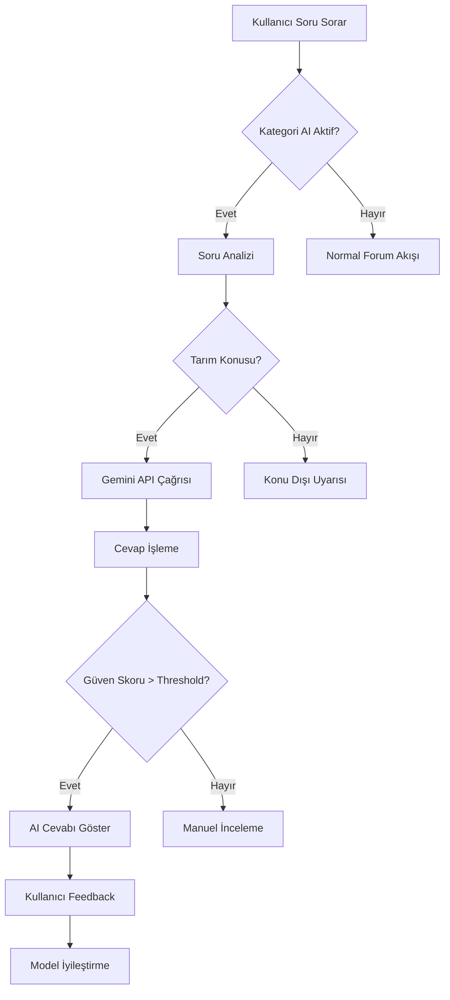

# GreenAI Forum - AI Entegrasyonu Dokümantasyonu

## 🤖 AI Entegrasyonu Genel Bakış

GreenAI Forum platformuna yapay zeka entegrasyonu iki aşamada gerçekleştirilecek:

1. **Aşama 1**: Google Gemini 2.0 Flash API entegrasyonu (Kısa vadeli)
2. **Aşama 2**: Özelleştirilmiş tarım AI modeli (Uzun vadeli)

## 🚀 Aşama 1: Gemini API Entegrasyonu

### 🎯 Hedefler
- Forum sorularına otomatik AI cevapları sağlama
- Tarım/çiftçilik konularında uzman önerileri
- AI cevaplarının kullanıcı cevaplarından ayrı gösterimi
- Kategori bazlı AI aktivasyonu

### 🏗️ Teknik Mimari

```
┌─────────────────┐    ┌─────────────────┐    ┌─────────────────┐
│   User Posts    │    │   AI Service    │    │  Gemini API     │
│   Question      │───▶│   Processor     │───▶│  (Google)       │
└─────────────────┘    └─────────────────┘    └─────────────────┘
         │                       │                       │
         ▼                       ▼                       ▼
┌─────────────────┐    ┌─────────────────┐    ┌─────────────────┐
│   Forum DB      │    │   AI Response   │    │   Response      │
│   (Topics)      │◀───│   Generator     │◀───│   Processing    │
└─────────────────┘    └─────────────────┘    └─────────────────┘
```

### 📊 Veritabanı Şeması Güncellemeleri

```sql
-- AI cevapları için yeni tablo
CREATE TABLE ai_responses (
    id UUID PRIMARY KEY DEFAULT gen_random_uuid(),
    topic_id UUID REFERENCES topics(id) ON DELETE CASCADE,
    model_name VARCHAR(50) NOT NULL DEFAULT 'gemini-2.0-flash',
    prompt_text TEXT NOT NULL,
    response_text TEXT NOT NULL,
    confidence_score DECIMAL(3,2), -- 0.00-1.00
    processing_time_ms INTEGER,
    tokens_used INTEGER,
    cost_usd DECIMAL(10,4),
    is_active BOOLEAN DEFAULT true,
    created_at TIMESTAMP WITH TIME ZONE DEFAULT NOW(),
    updated_at TIMESTAMP WITH TIME ZONE DEFAULT NOW()
);

-- AI konfigürasyonu tablosu
CREATE TABLE ai_category_config (
    id UUID PRIMARY KEY DEFAULT gen_random_uuid(),
    category_id UUID REFERENCES categories(id) ON DELETE CASCADE,
    ai_enabled BOOLEAN DEFAULT false,
    auto_response BOOLEAN DEFAULT false, -- Otomatik cevap ver
    confidence_threshold DECIMAL(3,2) DEFAULT 0.70,
    max_tokens INTEGER DEFAULT 1000,
    temperature DECIMAL(3,2) DEFAULT 0.7,
    created_at TIMESTAMP WITH TIME ZONE DEFAULT NOW(),
    UNIQUE(category_id)
);

-- AI feedback tablosu
CREATE TABLE ai_response_feedback (
    id UUID PRIMARY KEY DEFAULT gen_random_uuid(),
    ai_response_id UUID REFERENCES ai_responses(id) ON DELETE CASCADE,
    user_id UUID REFERENCES users(id) ON DELETE CASCADE,
    feedback_type VARCHAR(20) NOT NULL, -- helpful, not_helpful, incorrect
    feedback_text TEXT,
    created_at TIMESTAMP WITH TIME ZONE DEFAULT NOW(),
    UNIQUE(ai_response_id, user_id)
);
```

### 🔧 API Endpoints

```typescript
// AI cevap endpoints
POST   /api/ai/generate-response/:topicId
GET    /api/ai/responses/:topicId
PUT    /api/ai/responses/:responseId/feedback
DELETE /api/ai/responses/:responseId

// AI konfigürasyon endpoints
GET    /api/ai/config/categories
PUT    /api/ai/config/categories/:categoryId
GET    /api/ai/analytics
```

### 🎨 UI/UX Tasarımı

#### AI Cevap Komponenti
```typescript
interface AIResponseProps {
  response: AIResponse;
  onFeedback: (feedback: FeedbackType) => void;
  isLoading?: boolean;
}

// AI cevabı görsel ayrımı
- 🤖 AI Asistanı ikonu
- Farklı background rengi (açık mavi/yeşil)
- "AI tarafından oluşturuldu" etiketi
- Güven skoru göstergesi
- Feedback butonları (👍 👎 ⚠️)
```

#### Kategori Ayarları
```typescript
interface AICategorySettings {
  categoryId: string;
  aiEnabled: boolean;
  autoResponse: boolean;
  confidenceThreshold: number;
  responseDelay: number; // dakika
}
```

### 🔒 Güvenlik ve Moderasyon

#### Content Filtering
```typescript
const contentFilters = {
  // Zararlı içerik filtreleme
  harmfulContent: true,
  // Yanlış bilgi kontrolü
  misinformationCheck: true,
  // Türkçe dil kontrolü
  languageValidation: true,
  // Tarım konusu relevansı
  topicRelevance: true
};
```

#### Rate Limiting
```typescript
const aiRateLimits = {
  // Kullanıcı başına günlük AI sorgu limiti
  userDailyLimit: 50,
  // Kategori başına saatlik limit
  categoryHourlyLimit: 100,
  // Global günlük limit
  globalDailyLimit: 10000
};
```

## 🧠 Aşama 2: Özelleştirilmiş AI Modeli

### 🎯 Uzun Vadeli Hedefler
- Türkiye'nin iklim koşullarına özel AI modeli
- Yerel tarım uygulamalarına odaklı öneriler
- Forum verilerinden öğrenen adaptif sistem
- Çok dilli destek (Türkçe, Kürtçe, Arapça)

### 🏗️ Teknik Yaklaşımlar

#### 1. Fine-Tuning Stratejisi
```python
# Model fine-tuning pipeline
class AgricultureModelTrainer:
    def __init__(self):
        self.base_model = "gemini-pro"
        self.training_data = ForumDataProcessor()
        self.evaluation_metrics = ["accuracy", "relevance", "safety"]
    
    def prepare_training_data(self):
        # Forum Q&A çiftlerini hazırla
        # Uzman cevaplarını label olarak kullan
        # Türkiye'ye özel tarım verilerini ekle
        pass
    
    def fine_tune_model(self):
        # Model fine-tuning süreci
        # Validation ve testing
        # Performance monitoring
        pass
```

#### 2. RAG (Retrieval-Augmented Generation)
```typescript
interface RAGSystem {
  // Bilgi tabanı
  knowledgeBase: {
    turkishAgriculture: Document[];
    climateData: WeatherData[];
    soilTypes: SoilData[];
    cropDatabase: CropInfo[];
    diseaseDatabase: DiseaseInfo[];
  };
  
  // Retrieval sistemi
  retriever: VectorSearchEngine;
  
  // Generation sistemi
  generator: LanguageModel;
}
```

#### 3. Veri Toplama Stratejisi
```typescript
const dataCollectionSources = {
  // Forum verileri
  forumData: {
    questions: "Kullanıcı soruları",
    expertAnswers: "Uzman cevapları",
    userFeedback: "Kullanıcı geri bildirimleri",
    successfulSolutions: "Başarılı çözümler"
  },
  
  // Dış kaynaklar
  externalSources: {
    governmentData: "Tarım Bakanlığı verileri",
    researchPapers: "Akademik makaleler",
    weatherData: "Meteoroloji verileri",
    marketPrices: "Pazar fiyatları"
  }
};
```

### 📊 Model Performans Metrikleri

```typescript
interface ModelMetrics {
  // Doğruluk metrikleri
  accuracy: number;
  precision: number;
  recall: number;
  f1Score: number;
  
  // Kullanıcı memnuniyeti
  userSatisfaction: number;
  helpfulnessRating: number;
  
  // İş metrikleri
  responseTime: number;
  costPerQuery: number;
  userEngagement: number;
}
```

## 🔄 Entegrasyon Akışı

### Soru Sorulduğunda AI Akışı


### Prompt Engineering
```typescript
const promptTemplates = {
  diseaseIdentification: `
    Sen bir tarım uzmanısın. Aşağıdaki bitki hastalığı sorusunu analiz et:
    
    Soru: {question}
    Kategori: {category}
    Fotoğraflar: {hasImages}
    
    Lütfen şu formatta cevap ver:
    1. Olası hastalık teşhisi
    2. Tedavi önerileri
    3. Önleme yöntemleri
    4. Ek bilgi kaynakları
    
    Türkiye'nin iklim koşullarını göz önünde bulundur.
  `,
  
  fertilizerRecommendation: `
    Sen bir gübre uzmanısın. Aşağıdaki gübre sorusunu yanıtla:
    
    Soru: {question}
    Bitki türü: {cropType}
    Toprak tipi: {soilType}
    Bölge: {region}
    
    Organik ve kimyasal gübre seçeneklerini değerlendir.
    Türkiye'de bulunabilir ürünleri öner.
  `
};
```

## 💰 Maliyet Analizi

### Gemini API Maliyetleri
```typescript
const geminiPricing = {
  // Gemini 2.0 Flash fiyatlandırması
  inputTokens: 0.000075, // per 1K tokens
  outputTokens: 0.0003,  // per 1K tokens
  
  // Aylık tahminler
  estimatedMonthlyUsage: {
    queries: 10000,
    avgInputTokens: 500,
    avgOutputTokens: 300,
    monthlyCost: 37.5 // USD
  }
};
```

### Özelleştirilmiş Model Maliyetleri
```typescript
const customModelCosts = {
  // Fine-tuning maliyetleri
  trainingCost: 5000, // USD (one-time)
  
  // Hosting maliyetleri
  monthlyHosting: 500, // USD
  
  // Veri toplama ve işleme
  dataProcessing: 2000, // USD (one-time)
  
  // Toplam ilk yıl maliyeti
  firstYearTotal: 13500 // USD
};
```

Bu AI entegrasyonu, GreenAI Forum'u Türkiye'nin en gelişmiş tarım platformu haline getirecek!
