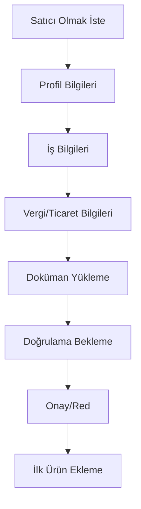
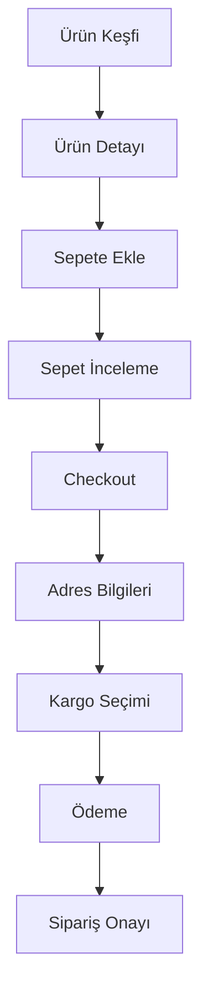

# GreenAI Forum - E-Ticaret Sistemi Entegrasyonu

## 🛒 E-Ticaret Sistemi Genel Bakış

GreenAI Forum'a entegre edilecek e-ticaret sistemi, çiftçiler ve tarım uzmanlarının birbirleriyle güvenli ticaret yapabilecekleri kapsamlı bir marketplace olacaktır.

## 🎯 Sistem Hedefleri

### Ana Hedefler
- 🌱 Tarım sektöründe B2B ve B2C ticaretin kolaylaştırılması
- 🤝 Forum topluluğu ile e-ticaret entegrasyonu
- 🇹🇷 Türkiye'ye özel yerel çözümler
- 🔒 Güvenli ve güvenilir ticaret ortamı
- 📱 Mobil-first yaklaşım

### Hedef Kullanıcılar
- **Çiftçiler**: Ürün satışı ve tarım girdisi alımı
- **Tarım Uzmanları**: Danışmanlık hizmetleri ve özel ürünler
- **Kurumsal Satıcılar**: Tohum firmaları, ekipman üreticileri
- **Hobi Bahçıvanları**: Küçük ölçekli alım-satım

## 🏗️ Sistem Mimarisi

### Entegre Mimari Tasarımı
```
┌─────────────────────────────────────────────────────────────┐
│                    GreenAI Platform                        │
├─────────────────────────────────────────────────────────────┤
│  ┌─────────────┐  ┌─────────────┐  ┌─────────────┐        │
│  │   Forum     │  │ E-Commerce  │  │  AI System  │        │
│  │   System    │◄─┤   System    ├─►│             │        │
│  └─────────────┘  └─────────────┘  └─────────────┘        │
├─────────────────────────────────────────────────────────────┤
│  ┌─────────────┐  ┌─────────────┐  ┌─────────────┐        │
│  │   Payment   │  │   Shipping  │  │ Notification│        │
│  │   Gateway   │  │   System    │  │   System    │        │
│  └─────────────┘  └─────────────┘  └─────────────┘        │
├─────────────────────────────────────────────────────────────┤
│  ┌─────────────┐  ┌─────────────┐  ┌─────────────┐        │
│  │   User      │  │   Product   │  │   Order     │        │
│  │ Management  │  │ Management  │  │ Management  │        │
│  └─────────────┘  └─────────────┘  └─────────────┘        │
└─────────────────────────────────────────────────────────────┘
```

## 📊 Veritabanı Şeması

### E-Ticaret Tabloları

```sql
-- Satıcı profilleri
CREATE TABLE seller_profiles (
    id UUID PRIMARY KEY DEFAULT gen_random_uuid(),
    user_id UUID REFERENCES users(id) ON DELETE CASCADE,
    business_name VARCHAR(255),
    business_type VARCHAR(50), -- individual, company, cooperative
    tax_number VARCHAR(20),
    trade_registry_number VARCHAR(50),
    address TEXT NOT NULL,
    city VARCHAR(100) NOT NULL,
    district VARCHAR(100),
    postal_code VARCHAR(10),
    phone VARCHAR(20) NOT NULL,
    is_verified BOOLEAN DEFAULT false,
    verification_documents JSONB,
    seller_rating DECIMAL(3,2) DEFAULT 0.00,
    total_sales INTEGER DEFAULT 0,
    created_at TIMESTAMP WITH TIME ZONE DEFAULT NOW(),
    updated_at TIMESTAMP WITH TIME ZONE DEFAULT NOW()
);

-- Ürün kategorileri
CREATE TABLE product_categories (
    id UUID PRIMARY KEY DEFAULT gen_random_uuid(),
    name VARCHAR(100) NOT NULL,
    slug VARCHAR(100) UNIQUE NOT NULL,
    description TEXT,
    parent_id UUID REFERENCES product_categories(id),
    icon VARCHAR(50),
    sort_order INTEGER DEFAULT 0,
    is_active BOOLEAN DEFAULT true,
    created_at TIMESTAMP WITH TIME ZONE DEFAULT NOW()
);

-- Ürünler
CREATE TABLE products (
    id UUID PRIMARY KEY DEFAULT gen_random_uuid(),
    seller_id UUID REFERENCES seller_profiles(id) ON DELETE CASCADE,
    category_id UUID REFERENCES product_categories(id),
    name VARCHAR(255) NOT NULL,
    slug VARCHAR(255) UNIQUE NOT NULL,
    description TEXT NOT NULL,
    short_description TEXT,
    sku VARCHAR(100),
    price DECIMAL(10,2) NOT NULL,
    compare_price DECIMAL(10,2), -- original price for discounts
    cost_price DECIMAL(10,2), -- seller's cost
    stock_quantity INTEGER DEFAULT 0,
    min_order_quantity INTEGER DEFAULT 1,
    max_order_quantity INTEGER,
    weight DECIMAL(8,2), -- kg
    dimensions JSONB, -- {length, width, height}
    is_digital BOOLEAN DEFAULT false,
    requires_shipping BOOLEAN DEFAULT true,
    status VARCHAR(20) DEFAULT 'draft', -- draft, active, inactive, out_of_stock
    featured BOOLEAN DEFAULT false,
    tags TEXT[],
    seo_title VARCHAR(255),
    seo_description TEXT,
    created_at TIMESTAMP WITH TIME ZONE DEFAULT NOW(),
    updated_at TIMESTAMP WITH TIME ZONE DEFAULT NOW()
);

-- Ürün varyantları (renk, boyut, vs.)
CREATE TABLE product_variants (
    id UUID PRIMARY KEY DEFAULT gen_random_uuid(),
    product_id UUID REFERENCES products(id) ON DELETE CASCADE,
    name VARCHAR(255) NOT NULL,
    sku VARCHAR(100),
    price DECIMAL(10,2),
    stock_quantity INTEGER DEFAULT 0,
    attributes JSONB, -- {color: "red", size: "large"}
    created_at TIMESTAMP WITH TIME ZONE DEFAULT NOW()
);

-- Ürün görselleri
CREATE TABLE product_images (
    id UUID PRIMARY KEY DEFAULT gen_random_uuid(),
    product_id UUID REFERENCES products(id) ON DELETE CASCADE,
    variant_id UUID REFERENCES product_variants(id) ON DELETE CASCADE,
    image_url TEXT NOT NULL,
    alt_text VARCHAR(255),
    sort_order INTEGER DEFAULT 0,
    is_primary BOOLEAN DEFAULT false,
    created_at TIMESTAMP WITH TIME ZONE DEFAULT NOW()
);

-- Sepet
CREATE TABLE cart_items (
    id UUID PRIMARY KEY DEFAULT gen_random_uuid(),
    user_id UUID REFERENCES users(id) ON DELETE CASCADE,
    product_id UUID REFERENCES products(id) ON DELETE CASCADE,
    variant_id UUID REFERENCES product_variants(id) ON DELETE SET NULL,
    quantity INTEGER NOT NULL DEFAULT 1,
    price DECIMAL(10,2) NOT NULL, -- price at time of adding to cart
    created_at TIMESTAMP WITH TIME ZONE DEFAULT NOW(),
    updated_at TIMESTAMP WITH TIME ZONE DEFAULT NOW(),
    UNIQUE(user_id, product_id, variant_id)
);

-- Siparişler
CREATE TABLE orders (
    id UUID PRIMARY KEY DEFAULT gen_random_uuid(),
    order_number VARCHAR(50) UNIQUE NOT NULL,
    user_id UUID REFERENCES users(id) ON DELETE SET NULL,
    status VARCHAR(20) DEFAULT 'pending', -- pending, confirmed, processing, shipped, delivered, cancelled, refunded
    payment_status VARCHAR(20) DEFAULT 'pending', -- pending, paid, failed, refunded
    
    -- Billing address
    billing_first_name VARCHAR(100) NOT NULL,
    billing_last_name VARCHAR(100) NOT NULL,
    billing_company VARCHAR(255),
    billing_address_1 TEXT NOT NULL,
    billing_address_2 TEXT,
    billing_city VARCHAR(100) NOT NULL,
    billing_state VARCHAR(100),
    billing_postal_code VARCHAR(10) NOT NULL,
    billing_country VARCHAR(2) DEFAULT 'TR',
    billing_phone VARCHAR(20),
    billing_email VARCHAR(255) NOT NULL,
    
    -- Shipping address
    shipping_first_name VARCHAR(100),
    shipping_last_name VARCHAR(100),
    shipping_company VARCHAR(255),
    shipping_address_1 TEXT,
    shipping_address_2 TEXT,
    shipping_city VARCHAR(100),
    shipping_state VARCHAR(100),
    shipping_postal_code VARCHAR(10),
    shipping_country VARCHAR(2) DEFAULT 'TR',
    shipping_phone VARCHAR(20),
    
    -- Order totals
    subtotal DECIMAL(10,2) NOT NULL DEFAULT 0.00,
    tax_total DECIMAL(10,2) NOT NULL DEFAULT 0.00,
    shipping_total DECIMAL(10,2) NOT NULL DEFAULT 0.00,
    discount_total DECIMAL(10,2) NOT NULL DEFAULT 0.00,
    total DECIMAL(10,2) NOT NULL DEFAULT 0.00,
    
    -- Payment info
    payment_method VARCHAR(50),
    payment_method_title VARCHAR(255),
    transaction_id VARCHAR(255),
    
    -- Shipping info
    shipping_method VARCHAR(50),
    shipping_method_title VARCHAR(255),
    tracking_number VARCHAR(255),
    
    -- Notes
    customer_note TEXT,
    admin_note TEXT,
    
    created_at TIMESTAMP WITH TIME ZONE DEFAULT NOW(),
    updated_at TIMESTAMP WITH TIME ZONE DEFAULT NOW()
);

-- Sipariş kalemleri
CREATE TABLE order_items (
    id UUID PRIMARY KEY DEFAULT gen_random_uuid(),
    order_id UUID REFERENCES orders(id) ON DELETE CASCADE,
    product_id UUID REFERENCES products(id) ON DELETE SET NULL,
    variant_id UUID REFERENCES product_variants(id) ON DELETE SET NULL,
    seller_id UUID REFERENCES seller_profiles(id) ON DELETE SET NULL,
    
    name VARCHAR(255) NOT NULL,
    sku VARCHAR(100),
    quantity INTEGER NOT NULL,
    price DECIMAL(10,2) NOT NULL, -- unit price
    total DECIMAL(10,2) NOT NULL, -- quantity * price
    
    product_data JSONB, -- snapshot of product at time of order
    created_at TIMESTAMP WITH TIME ZONE DEFAULT NOW()
);
```

## 🔌 API Endpoint Tasarımı

### Ürün Yönetimi Endpoints
```typescript
// Ürün CRUD
GET    /api/products                    // Ürün listesi (filtreleme, arama)
GET    /api/products/:id               // Ürün detayı
POST   /api/products                   // Yeni ürün oluştur (satıcı)
PUT    /api/products/:id               // Ürün güncelle (satıcı)
DELETE /api/products/:id               // Ürün sil (satıcı)

// Ürün kategorileri
GET    /api/products/categories        // Kategori listesi
GET    /api/products/categories/:slug  // Kategori ürünleri

// Ürün arama ve filtreleme
GET    /api/products/search            // Gelişmiş arama
GET    /api/products/featured          // Öne çıkan ürünler
GET    /api/products/recommendations   // AI destekli öneriler

// Satıcı ürünleri
GET    /api/sellers/:id/products       // Satıcının ürünleri
```

### Sepet ve Sipariş Endpoints
```typescript
// Sepet yönetimi
GET    /api/cart                       // Sepet içeriği
POST   /api/cart/add                   // Sepete ürün ekle
PUT    /api/cart/update                // Sepet güncelle
DELETE /api/cart/remove                // Sepetten ürün çıkar
DELETE /api/cart/clear                 // Sepeti temizle

// Sipariş yönetimi
POST   /api/orders                     // Sipariş oluştur
GET    /api/orders                     // Kullanıcı siparişleri
GET    /api/orders/:id                 // Sipariş detayı
PUT    /api/orders/:id/cancel          // Sipariş iptal et

// Satıcı sipariş yönetimi
GET    /api/seller/orders              // Satıcı siparişleri
PUT    /api/seller/orders/:id/status   // Sipariş durumu güncelle
POST   /api/seller/orders/:id/ship     // Kargo bilgisi ekle
```

### Ödeme Sistemi Endpoints
```typescript
// Ödeme işlemleri
POST   /api/payments/initialize        // Ödeme başlat
POST   /api/payments/callback          // Ödeme callback
GET    /api/payments/:id/status        // Ödeme durumu
POST   /api/payments/:id/refund        // İade işlemi
```

### Satıcı Yönetimi Endpoints
```typescript
// Satıcı profili
GET    /api/seller/profile             // Satıcı profili
PUT    /api/seller/profile             // Profil güncelle
POST   /api/seller/verification        // Doğrulama başvurusu

// Satıcı istatistikleri
GET    /api/seller/analytics           // Satış analitikleri
GET    /api/seller/earnings            // Kazanç raporu
GET    /api/seller/reviews             // Satıcı değerlendirmeleri
```

## 🎨 UI/UX Tasarımı ve Kullanıcı Akışları

### Ana Sayfa Entegrasyonu
```typescript
interface MarketplaceHomePage {
  // Forum entegrasyonu
  forumToProductSuggestions: boolean;
  featuredProducts: Product[];
  categoryShowcase: Category[];
  
  // Yerel odak
  regionalProducts: Product[];
  seasonalProducts: Product[];
  nearbyFarmers: Seller[];
  
  // AI entegrasyonu
  personalizedRecommendations: Product[];
  trendingProducts: Product[];
}
```

### Ürün Detay Sayfası
```typescript
interface ProductDetailPage {
  // Temel bilgiler
  productInfo: ProductInfo;
  sellerInfo: SellerInfo;
  images: ProductImage[];
  variants: ProductVariant[];
  
  // Forum entegrasyonu
  relatedForumTopics: ForumTopic[];
  expertReviews: ExpertReview[];
  
  // Sosyal kanıt
  customerReviews: Review[];
  qaSection: QASection;
  
  // Satın alma
  addToCartButton: CartAction;
  buyNowButton: CheckoutAction;
  wishlistButton: WishlistAction;
}
```

### Kullanıcı Akışları

#### Satıcı Onboarding Akışı


#### Satın Alma Akışı


## 💳 Ödeme Sistemi Entegrasyonu

### Türkiye'ye Uygun Ödeme Sağlayıcıları

#### İyzico Entegrasyonu
```typescript
class IyzicoPaymentService {
  private iyzipay: any;
  
  constructor() {
    this.iyzipay = new Iyzipay({
      apiKey: process.env.IYZICO_API_KEY,
      secretKey: process.env.IYZICO_SECRET_KEY,
      uri: process.env.IYZICO_BASE_URL
    });
  }
  
  async initializePayment(orderData: OrderData): Promise<PaymentResult> {
    const request = {
      locale: 'tr',
      conversationId: orderData.orderId,
      price: orderData.total.toString(),
      paidPrice: orderData.total.toString(),
      currency: 'TRY',
      basketId: orderData.orderId,
      paymentGroup: 'PRODUCT',
      callbackUrl: `${process.env.BASE_URL}/api/payments/callback`,
      enabledInstallments: [2, 3, 6, 9],
      buyer: {
        id: orderData.buyer.id,
        name: orderData.buyer.firstName,
        surname: orderData.buyer.lastName,
        gsmNumber: orderData.buyer.phone,
        email: orderData.buyer.email,
        identityNumber: orderData.buyer.tcNo,
        registrationAddress: orderData.buyer.address,
        ip: orderData.buyer.ip,
        city: orderData.buyer.city,
        country: 'Turkey'
      },
      shippingAddress: {
        contactName: orderData.shipping.fullName,
        city: orderData.shipping.city,
        country: 'Turkey',
        address: orderData.shipping.address
      },
      billingAddress: {
        contactName: orderData.billing.fullName,
        city: orderData.billing.city,
        country: 'Turkey',
        address: orderData.billing.address
      },
      basketItems: orderData.items.map(item => ({
        id: item.productId,
        name: item.name,
        category1: item.category,
        itemType: 'PHYSICAL',
        price: item.total.toString()
      }))
    };
    
    return new Promise((resolve, reject) => {
      this.iyzipay.checkoutFormInitialize.create(request, (err: any, result: any) => {
        if (err) {
          reject(err);
        } else {
          resolve({
            paymentPageUrl: result.paymentPageUrl,
            token: result.token
          });
        }
      });
    });
  }
}
```

#### PayTR Entegrasyonu
```typescript
class PayTRPaymentService {
  private merchantId: string;
  private merchantKey: string;
  private merchantSalt: string;
  
  constructor() {
    this.merchantId = process.env.PAYTR_MERCHANT_ID!;
    this.merchantKey = process.env.PAYTR_MERCHANT_KEY!;
    this.merchantSalt = process.env.PAYTR_MERCHANT_SALT!;
  }
  
  async createPaymentForm(orderData: OrderData): Promise<string> {
    const basketItems = orderData.items.map(item => 
      `${item.name},${item.price},${item.quantity}`
    ).join(';');
    
    const hashStr = `${this.merchantId}${orderData.buyer.ip}${orderData.orderId}${orderData.buyer.email}${orderData.total}${basketItems}${this.merchantSalt}`;
    const paytrToken = crypto.createHmac('sha256', this.merchantKey).update(hashStr).digest('base64');
    
    const formData = {
      merchant_id: this.merchantId,
      user_ip: orderData.buyer.ip,
      merchant_oid: orderData.orderId,
      email: orderData.buyer.email,
      payment_amount: Math.round(orderData.total * 100), // kuruş cinsinden
      paytr_token: paytrToken,
      user_basket: basketItems,
      debug_on: process.env.NODE_ENV === 'development' ? 1 : 0,
      no_installment: 0,
      max_installment: 12,
      user_name: `${orderData.buyer.firstName} ${orderData.buyer.lastName}`,
      user_address: orderData.buyer.address,
      user_phone: orderData.buyer.phone,
      merchant_ok_url: `${process.env.BASE_URL}/payment/success`,
      merchant_fail_url: `${process.env.BASE_URL}/payment/fail`,
      timeout_limit: 30,
      currency: 'TL'
    };
    
    // PayTR iframe HTML'i oluştur
    return this.generatePaymentIframe(formData);
  }
}
```

## 🚚 Kargo Entegrasyonu

### Türkiye Kargo Firmaları Entegrasyonu

```typescript
interface ShippingProvider {
  name: string;
  code: string;
  calculateShipping(from: Address, to: Address, weight: number): Promise<ShippingRate[]>;
  createShipment(orderData: OrderData): Promise<ShipmentResult>;
  trackShipment(trackingNumber: string): Promise<TrackingInfo>;
}

class ArasCargoService implements ShippingProvider {
  name = 'Aras Kargo';
  code = 'aras';
  
  async calculateShipping(from: Address, to: Address, weight: number): Promise<ShippingRate[]> {
    // Aras Kargo API entegrasyonu
    const response = await fetch('https://api.araskargo.com.tr/v1/calculate', {
      method: 'POST',
      headers: {
        'Authorization': `Bearer ${process.env.ARAS_API_KEY}`,
        'Content-Type': 'application/json'
      },
      body: JSON.stringify({
        from_city: from.city,
        to_city: to.city,
        weight: weight,
        service_type: 'standard'
      })
    });
    
    const data = await response.json();
    return data.rates;
  }
}

class YurticiCargoService implements ShippingProvider {
  name = 'Yurtiçi Kargo';
  code = 'yurtici';
  
  async calculateShipping(from: Address, to: Address, weight: number): Promise<ShippingRate[]> {
    // Yurtiçi Kargo API entegrasyonu
    // Implementation details...
  }
}

class PTTCargoService implements ShippingProvider {
  name = 'PTT Kargo';
  code = 'ptt';
  
  async calculateShipping(from: Address, to: Address, weight: number): Promise<ShippingRate[]> {
    // PTT Kargo API entegrasyonu
    // Implementation details...
  }
}
```

## 🔒 Güvenlik ve Moderasyon Stratejisi

### Satıcı Doğrulama Sistemi

#### Doğrulama Seviyeleri
```typescript
enum VerificationLevel {
  UNVERIFIED = 'unverified',
  BASIC = 'basic',           // Kimlik doğrulaması
  BUSINESS = 'business',     // İş belgesi doğrulaması
  PREMIUM = 'premium',       // Tam doğrulama + referanslar
  CORPORATE = 'corporate'    // Kurumsal hesap
}

interface VerificationRequirements {
  basic: {
    documents: ['tc_kimlik', 'selfie'];
    manualReview: true;
    autoApproval: false;
  };
  business: {
    documents: ['vergi_levhasi', 'ticaret_sicil', 'imza_sirküleri'];
    manualReview: true;
    autoApproval: false;
  };
  premium: {
    documents: ['all_business_docs', 'referans_mektuplari'];
    backgroundCheck: true;
    manualReview: true;
  };
}
```

#### KYC (Know Your Customer) Süreci
```typescript
class KYCService {
  async verifyIdentity(userId: string, documents: Document[]): Promise<VerificationResult> {
    // 1. Doküman doğrulama
    const docVerification = await this.verifyDocuments(documents);

    // 2. Kimlik doğrulama (3. parti servis)
    const identityCheck = await this.checkIdentity(documents.tcKimlik);

    // 3. Adres doğrulama
    const addressVerification = await this.verifyAddress(documents.adresBelgesi);

    // 4. Risk skorlaması
    const riskScore = await this.calculateRiskScore(userId);

    return {
      status: this.determineVerificationStatus(docVerification, identityCheck, addressVerification, riskScore),
      riskScore,
      requiredActions: this.getRequiredActions(riskScore)
    };
  }

  private async checkIdentity(tcKimlik: string): Promise<boolean> {
    // Nüfus ve Vatandaşlık İşleri API entegrasyonu
    // Kimlik doğrulama servisi
    return true;
  }
}
```

### Ürün Kalite Kontrolü

#### Otomatik Moderasyon
```typescript
class ProductModerationService {
  async moderateProduct(product: Product): Promise<ModerationResult> {
    const checks = await Promise.all([
      this.checkProhibitedItems(product),
      this.validateProductInfo(product),
      this.checkImageContent(product.images),
      this.validatePricing(product),
      this.checkDuplicates(product)
    ]);

    const issues = checks.filter(check => !check.passed);

    return {
      approved: issues.length === 0,
      issues: issues,
      requiresManualReview: issues.some(issue => issue.severity === 'high'),
      autoActions: this.getAutoActions(issues)
    };
  }

  private async checkProhibitedItems(product: Product): Promise<CheckResult> {
    const prohibitedKeywords = [
      'yasadışı', 'kaçak', 'sahte', 'kopya',
      'zararlı kimyasal', 'yasaklı ilaç'
    ];

    const content = `${product.name} ${product.description}`.toLowerCase();
    const foundProhibited = prohibitedKeywords.some(keyword =>
      content.includes(keyword)
    );

    return {
      passed: !foundProhibited,
      severity: foundProhibited ? 'high' : 'none',
      message: foundProhibited ? 'Yasaklı ürün tespit edildi' : 'OK'
    };
  }
}
```

### Anlaşmazlık Çözümü

#### Dispute Management Sistemi
```typescript
interface DisputeCase {
  id: string;
  orderId: string;
  buyerId: string;
  sellerId: string;
  type: 'product_not_received' | 'product_defective' | 'wrong_product' | 'refund_request';
  status: 'open' | 'investigating' | 'resolved' | 'escalated';
  evidence: Evidence[];
  resolution?: Resolution;
  createdAt: Date;
  resolvedAt?: Date;
}

class DisputeResolutionService {
  async createDispute(disputeData: CreateDisputeData): Promise<DisputeCase> {
    // 1. Otomatik çözüm kontrolü
    const autoResolution = await this.checkAutoResolution(disputeData);
    if (autoResolution) {
      return this.resolveAutomatically(disputeData, autoResolution);
    }

    // 2. Manuel inceleme için kuyruğa al
    const dispute = await this.createDisputeCase(disputeData);

    // 3. İlgili taraflara bildirim gönder
    await this.notifyParties(dispute);

    return dispute;
  }

  async resolveDispute(disputeId: string, resolution: Resolution): Promise<void> {
    const dispute = await this.getDispute(disputeId);

    // Çözüm uygula
    switch (resolution.type) {
      case 'refund':
        await this.processRefund(dispute.orderId, resolution.amount);
        break;
      case 'replacement':
        await this.arrangeReplacement(dispute.orderId);
        break;
      case 'partial_refund':
        await this.processPartialRefund(dispute.orderId, resolution.amount);
        break;
    }

    // Dispute'u kapat
    await this.closeDispute(disputeId, resolution);
  }
}
```

### Güvenli Ödeme Sistemi

#### Escrow (Emanet) Sistemi
```typescript
class EscrowService {
  async holdPayment(orderId: string, amount: number): Promise<EscrowTransaction> {
    // Ödemeyi emanette tut
    const escrowTx = await this.createEscrowTransaction({
      orderId,
      amount,
      status: 'held',
      releaseConditions: ['product_delivered', 'buyer_confirmation']
    });

    // Satıcıya bildirim gönder
    await this.notifySeller(orderId, 'payment_held');

    return escrowTx;
  }

  async releasePayment(orderId: string, reason: string): Promise<void> {
    const escrowTx = await this.getEscrowTransaction(orderId);

    // Ödemeyi satıcıya aktar
    await this.transferToSeller(escrowTx.sellerId, escrowTx.amount);

    // Komisyon kes
    await this.deductCommission(escrowTx.amount);

    // Transaction'ı güncelle
    await this.updateEscrowStatus(orderId, 'released', reason);
  }
}
```

## 📱 Frontend UI Komponenleri

### E-Ticaret Ana Sayfa Komponenti
```typescript
// web/src/components/marketplace/MarketplaceHome.tsx
interface MarketplaceHomeProps {
  featuredProducts: Product[];
  categories: Category[];
  regionalProducts: Product[];
  forumIntegration: boolean;
}

export function MarketplaceHome({
  featuredProducts,
  categories,
  regionalProducts,
  forumIntegration
}: MarketplaceHomeProps) {
  return (
    <div className="marketplace-home">
      {/* Hero Section */}
      <section className="hero-section bg-gradient-to-r from-green-600 to-green-800 text-white py-16">
        <div className="container mx-auto px-4">
          <h1 className="text-4xl font-bold mb-4">
            Tarım Ürünleri Pazaryeri
          </h1>
          <p className="text-xl mb-8">
            Çiftçilerden doğrudan, güvenli alışveriş
          </p>
          <SearchBar placeholder="Ürün, kategori veya satıcı ara..." />
        </div>
      </section>

      {/* Forum Entegrasyonu */}
      {forumIntegration && (
        <ForumToMarketplaceBridge />
      )}

      {/* Kategoriler */}
      <CategoryShowcase categories={categories} />

      {/* Öne Çıkan Ürünler */}
      <FeaturedProducts products={featuredProducts} />

      {/* Bölgesel Ürünler */}
      <RegionalProducts products={regionalProducts} />

      {/* Güven Göstergeleri */}
      <TrustIndicators />
    </div>
  );
}
```

### Ürün Kartı Komponenti
```typescript
// web/src/components/marketplace/ProductCard.tsx
interface ProductCardProps {
  product: Product;
  seller: Seller;
  showSellerInfo?: boolean;
  forumContext?: ForumTopic;
}

export function ProductCard({
  product,
  seller,
  showSellerInfo = true,
  forumContext
}: ProductCardProps) {
  return (
    <Card className="product-card hover:shadow-lg transition-shadow">
      <div className="relative">
        <Image
          src={product.primaryImage}
          alt={product.name}
          className="w-full h-48 object-cover"
        />

        {/* Forum Bağlantısı */}
        {forumContext && (
          <Badge className="absolute top-2 left-2 bg-blue-600">
            Forum'dan Önerilen
          </Badge>
        )}

        {/* Güven Rozeti */}
        {seller.verificationLevel === 'premium' && (
          <Badge className="absolute top-2 right-2 bg-green-600">
            <Shield className="w-3 h-3 mr-1" />
            Doğrulanmış
          </Badge>
        )}
      </div>

      <CardContent className="p-4">
        <h3 className="font-semibold text-lg mb-2">{product.name}</h3>
        <p className="text-gray-600 text-sm mb-3 line-clamp-2">
          {product.shortDescription}
        </p>

        <div className="flex items-center justify-between mb-3">
          <span className="text-2xl font-bold text-green-600">
            ₺{product.price}
          </span>
          {product.comparePrice && (
            <span className="text-sm text-gray-500 line-through">
              ₺{product.comparePrice}
            </span>
          )}
        </div>

        {showSellerInfo && (
          <div className="flex items-center mb-3">
            <Avatar className="w-6 h-6 mr-2">
              <AvatarImage src={seller.avatar} />
              <AvatarFallback>{seller.name[0]}</AvatarFallback>
            </Avatar>
            <span className="text-sm text-gray-600">{seller.name}</span>
            <div className="flex items-center ml-2">
              <Star className="w-4 h-4 text-yellow-400 fill-current" />
              <span className="text-sm ml-1">{seller.rating}</span>
            </div>
          </div>
        )}

        <div className="flex gap-2">
          <Button
            variant="outline"
            size="sm"
            className="flex-1"
            onClick={() => addToCart(product.id)}
          >
            <ShoppingCart className="w-4 h-4 mr-1" />
            Sepete Ekle
          </Button>
          <Button
            size="sm"
            className="flex-1"
            onClick={() => buyNow(product.id)}
          >
            Hemen Al
          </Button>
        </div>
      </CardContent>
    </Card>
  );
}
```

## ⚖️ Yasal Gereksinimler ve Uyumluluk

### E-Ticaret Kanunu Uyumluluğu

#### Zorunlu Bilgiler ve Belgeler
```typescript
interface LegalRequirements {
  // 6563 sayılı Elektronik Ticaret Kanunu
  eCommerceCompliance: {
    merchantInfo: {
      companyName: string;
      tradeRegistryNumber: string;
      taxNumber: string;
      mersisNumber: string;
      address: string;
      phone: string;
      email: string;
    };

    // Ön bilgilendirme formu
    preInformationForm: {
      productDetails: string;
      totalPrice: number;
      paymentMethods: string[];
      deliveryInfo: string;
      withdrawalRight: string;
      warrantyInfo: string;
    };

    // Mesafeli satış sözleşmesi
    distanceSalesContract: {
      contractTerms: string;
      withdrawalRightPeriod: number; // 14 gün
      returnConditions: string;
      disputeResolution: string;
    };
  };

  // KVKK (Kişisel Verilerin Korunması)
  gdprCompliance: {
    dataProcessingConsent: boolean;
    dataRetentionPeriod: number;
    dataSubjectRights: string[];
    cookiePolicy: string;
    privacyPolicy: string;
  };

  // Vergi mevzuatı
  taxCompliance: {
    vatRate: number; // %18 veya %8
    witholdingTax: number; // Stopaj
    eInvoiceIntegration: boolean;
    monthlyTaxReporting: boolean;
  };
}
```

#### KVKK Uyumluluk Sistemi
```typescript
class KVKKComplianceService {
  async recordConsent(userId: string, consentType: string, details: any): Promise<void> {
    await this.saveConsentRecord({
      userId,
      consentType,
      consentDate: new Date(),
      consentDetails: details,
      ipAddress: details.ipAddress,
      userAgent: details.userAgent
    });
  }

  async handleDataSubjectRequest(request: DataSubjectRequest): Promise<void> {
    switch (request.type) {
      case 'access':
        await this.provideDataAccess(request.userId);
        break;
      case 'rectification':
        await this.rectifyData(request.userId, request.corrections);
        break;
      case 'erasure':
        await this.eraseData(request.userId);
        break;
      case 'portability':
        await this.exportUserData(request.userId);
        break;
    }
  }

  async anonymizeInactiveUsers(): Promise<void> {
    // 3 yıl boyunca aktif olmayan kullanıcıları anonimleştir
    const inactiveUsers = await this.getInactiveUsers(3 * 365);

    for (const user of inactiveUsers) {
      await this.anonymizeUserData(user.id);
    }
  }
}
```

### Vergi Entegrasyonu

#### E-Fatura Sistemi
```typescript
class EInvoiceService {
  async generateInvoice(order: Order): Promise<Invoice> {
    const invoice = {
      invoiceNumber: this.generateInvoiceNumber(),
      date: new Date(),
      seller: await this.getSellerTaxInfo(order.sellerId),
      buyer: await this.getBuyerTaxInfo(order.userId),
      items: order.items.map(item => ({
        description: item.name,
        quantity: item.quantity,
        unitPrice: item.price,
        vatRate: this.getVATRate(item.categoryId),
        totalAmount: item.total
      })),
      totalAmount: order.total,
      vatAmount: this.calculateVAT(order),
      currency: 'TRY'
    };

    // GİB e-Fatura sistemine gönder
    await this.sendToGIB(invoice);

    return invoice;
  }

  private getVATRate(categoryId: string): number {
    // Tarım ürünleri için özel KDV oranları
    const agricultureCategories = [
      'seeds', 'fertilizers', 'pesticides', 'tools'
    ];

    return agricultureCategories.includes(categoryId) ? 8 : 18;
  }
}
```

## 💰 Maliyet Analizi ve İş Modeli

### Geliştirme Maliyetleri

```typescript
const developmentCosts = {
  // Backend geliştirme (6 ay)
  backend: {
    seniorDeveloper: 2 * 15000 * 6, // 2 senior dev x 6 ay
    database: 5000, // PostgreSQL optimizasyon
    paymentIntegration: 15000, // İyzico, PayTR entegrasyonu
    shippingIntegration: 10000, // Kargo API'leri
    securityAudit: 8000,
    total: 228000 // TL
  },

  // Frontend geliştirme (4 ay)
  frontend: {
    seniorDeveloper: 1 * 15000 * 4, // 1 senior dev x 4 ay
    uiuxDesign: 25000,
    mobileOptimization: 15000,
    testing: 10000,
    total: 110000 // TL
  },

  // DevOps ve Infrastructure (2 ay)
  devops: {
    devopsEngineer: 1 * 12000 * 2,
    cloudSetup: 5000,
    monitoring: 3000,
    backup: 2000,
    total: 34000 // TL
  },

  // Yasal ve uyumluluk
  legal: {
    lawyer: 15000,
    kvkkConsultancy: 8000,
    eCommerceCompliance: 5000,
    total: 28000 // TL
  },

  // Toplam geliştirme maliyeti
  totalDevelopment: 400000 // TL (~$13,500)
};
```

### Operasyonel Maliyetler (Aylık)

```typescript
const operationalCosts = {
  // Infrastructure
  infrastructure: {
    serverCosts: 2000, // TL/ay
    databaseHosting: 800,
    cdnCosts: 300,
    backupStorage: 200,
    monitoring: 150,
    total: 3450 // TL/ay
  },

  // Third-party services
  thirdPartyServices: {
    paymentGateway: 500, // İşlem bazlı + sabit ücret
    shippingAPI: 300,
    smsService: 200,
    emailService: 100,
    securityServices: 400,
    total: 1500 // TL/ay
  },

  // Personnel
  personnel: {
    customerSupport: 8000, // 1 kişi
    moderator: 6000, // 1 kişi
    maintenance: 4000, // Part-time developer
    total: 18000 // TL/ay
  },

  // Marketing
  marketing: {
    digitalMarketing: 5000,
    contentCreation: 2000,
    influencerMarketing: 3000,
    total: 10000 // TL/ay
  },

  // Legal ve compliance
  legal: {
    monthlyLegalSupport: 2000,
    taxConsultancy: 1500,
    kvkkCompliance: 500,
    total: 4000 // TL/ay
  },

  // Toplam aylık maliyet
  totalMonthly: 36950 // TL/ay (~$1,250/ay)
};
```

### Gelir Modeli

```typescript
const revenueModel = {
  // Komisyon gelirleri
  commissionRevenue: {
    // Satış komisyonu: %3-8 arası (kategori bazlı)
    averageCommissionRate: 0.05, // %5
    monthlyGMV: 500000, // TL (Gross Merchandise Value)
    monthlyCommission: 25000, // TL
  },

  // Listing ücretleri
  listingFees: {
    basicListing: 0, // Ücretsiz
    featuredListing: 50, // TL/ay
    premiumListing: 150, // TL/ay
    monthlyListingRevenue: 8000 // TL
  },

  // Abonelik gelirleri
  subscriptionRevenue: {
    sellerPremium: 200, // TL/ay
    corporateAccount: 500, // TL/ay
    monthlySubscriptions: 15000 // TL
  },

  // Reklam gelirleri
  advertisingRevenue: {
    sponsoredProducts: 100, // TL/ürün/ay
    bannerAds: 1000, // TL/banner/ay
    monthlyAdRevenue: 12000 // TL
  },

  // Toplam aylık gelir
  totalMonthlyRevenue: 60000, // TL/ay

  // Net kar
  monthlyProfit: 23050, // TL/ay (60000 - 36950)
  annualProfit: 276600 // TL/yıl (~$9,350/yıl)
};
```

### ROI Analizi

```typescript
const roiAnalysis = {
  // Başabaş noktası
  breakEvenPoint: {
    months: Math.ceil(developmentCosts.totalDevelopment / revenueModel.monthlyProfit), // 18 ay
    totalInvestment: developmentCosts.totalDevelopment + (operationalCosts.totalMonthly * 18),
    breakEvenRevenue: 1080000 // TL
  },

  // 3 yıllık projeksiyon
  threeYearProjection: {
    year1: {
      revenue: 720000, // TL
      costs: 843400, // TL (development + operational)
      profit: -123400 // TL (zarar)
    },
    year2: {
      revenue: 1200000, // TL (%67 büyüme)
      costs: 443400, // TL (sadece operational)
      profit: 756600 // TL
    },
    year3: {
      revenue: 2000000, // TL (%67 büyüme)
      costs: 443400, // TL
      profit: 1556600 // TL
    },
    totalROI: 2189800 / 400000 * 100 // %547 ROI
  }
};
```

## 📅 Geliştirme Timeline'ı

### Faz 1: Temel E-Ticaret Altyapısı (8 hafta)
- **Hafta 1-2**: Veritabanı şeması ve API tasarımı
- **Hafta 3-4**: Ürün yönetimi ve katalog sistemi
- **Hafta 5-6**: Sepet ve sipariş yönetimi
- **Hafta 7-8**: Temel frontend UI ve entegrasyon

### Faz 2: Ödeme ve Güvenlik (6 hafta)
- **Hafta 9-10**: İyzico ve PayTR ödeme entegrasyonu
- **Hafta 11-12**: Güvenlik sistemi ve KYC
- **Hafta 13-14**: KVKK uyumluluk ve yasal gereksinimler

### Faz 3: Kargo ve Lojistik (4 hafta)
- **Hafta 15-16**: Kargo API entegrasyonları
- **Hafta 17-18**: Sipariş takip ve bildirim sistemi

### Faz 4: Forum Entegrasyonu (4 hafta)
- **Hafta 19-20**: Forum-marketplace köprü sistemi
- **Hafta 21-22**: AI destekli ürün önerileri

### Faz 5: Test ve Launch (4 hafta)
- **Hafta 23-24**: Kapsamlı test ve bug fix
- **Hafta 25-26**: Beta launch ve kullanıcı feedback

**Toplam Süre**: 26 hafta (~6.5 ay)

Bu e-ticaret sistemi, GreenAI Forum'u tam bir tarım ekosistemi haline getirecek!
