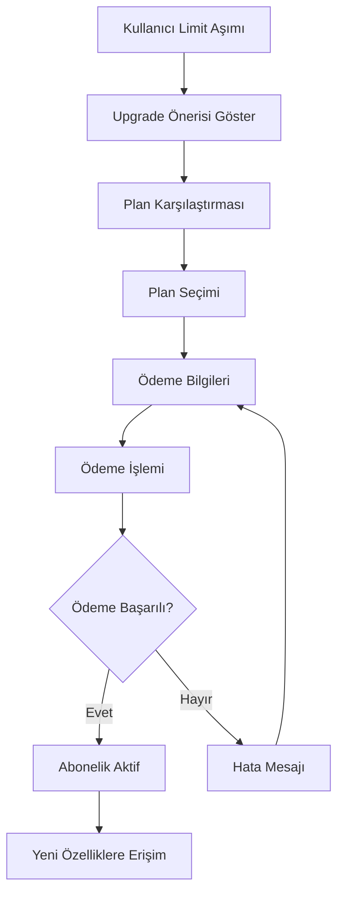

# GreenAI Forum - Üyelik Sistemi Dokümantasyonu

## 🎯 Üyelik Sistemi Genel Bakış

GreenAI Forum'un üyelik sistemi, kullanıcıları platform özelliklerini daha etkin kullanmaya teşvik eden, değer odaklı bir freemium modeldir. Sistem forum, e-ticaret ve AI özelliklerini kapsayacak şekilde tasarlanmıştır.

## 📊 Üyelik Seviyeleri ve Özellikleri

### 🌱 Ücretsiz (Temel) Üyelik
**Hedef Kitle**: Yeni kullanıcılar, hobi bahçıvanları, öğrenciler

**Forum Özellikleri:**
- ✅ Sınırsız konu okuma
- ✅ Günde 5 konu açma
- ✅ Günde 20 yorum yapma
- ✅ Temel arama özelliği
- ✅ Profil oluşturma
- ❌ Reklam gösterimi var
- ❌ Gelişmiş filtreleme yok

**E-Ticaret Özellikleri:**
- ✅ Ürün görüntüleme ve satın alma
- ✅ Temel satıcı profili (5 ürün)
- ✅ %8 satış komisyonu
- ❌ Öne çıkan ürün listeleme yok
- ❌ Gelişmiş analitikler yok

**AI Asistan Özellikleri:**
- ✅ Günde 5 AI sorgusu
- ✅ Temel tarım önerileri
- ❌ Öncelikli yanıt yok
- ❌ Özelleştirilmiş öneriler yok

---

### 🌿 Premium Üyelik - 49₺/ay
**Hedef Kitle**: Aktif çiftçiler, ciddi hobi bahçıvanları

**Forum Özellikleri:**
- ✅ Tüm temel özellikler
- ✅ Reklamsız deneyim
- ✅ Sınırsız konu ve yorum
- ✅ Gelişmiş arama ve filtreleme
- ✅ Özel "Premium" rozeti
- ✅ Öncelikli müşteri desteği
- ✅ Özel premium kategorilere erişim

**E-Ticaret Özellikleri:**
- ✅ %6 satış komisyonu (2% indirim)
- ✅ 50 ürün listeleme limiti
- ✅ Temel ürün analitikleri
- ✅ Haftalık 1 öne çıkan ürün
- ✅ Gelişmiş ürün editörü

**AI Asistan Özellikleri:**
- ✅ Günde 25 AI sorgusu
- ✅ Öncelikli yanıt (daha hızlı)
- ✅ Bölgesel özelleştirilmiş öneriler
- ✅ Mevsimsel tarım takvimi

**Ek Avantajlar:**
- 📧 Haftalık premium newsletter
- 📱 Mobil app'te premium özellikler
- 🎯 Kişiselleştirilmiş içerik önerileri

---

### 🌾 Pro Üyelik - 149₺/ay
**Hedef Kitle**: Profesyonel çiftçiler, tarım uzmanları, danışmanlar

**Forum Özellikleri:**
- ✅ Tüm Premium özellikler
- ✅ Özel "Pro Uzman" rozeti
- ✅ Moderatör ayrıcalıkları (kendi konularında)
- ✅ Gelişmiş istatistikler ve analitikler
- ✅ Özel uzman kategorilerine erişim
- ✅ Canlı webinar'lara katılım

**E-Ticaret Özellikleri:**
- ✅ %4 satış komisyonu (4% indirim)
- ✅ 200 ürün listeleme limiti
- ✅ Gelişmiş satış analitikleri
- ✅ Günlük 1 öne çıkan ürün
- ✅ Toplu ürün yükleme
- ✅ Özel satıcı sayfası tasarımı
- ✅ Müşteri yorumlarına öncelikli yanıt

**AI Asistan Özellikleri:**
- ✅ Günde 100 AI sorgusu
- ✅ Gelişmiş AI modeli erişimi
- ✅ Özelleştirilmiş tarım planları
- ✅ Hastalık teşhisi için görsel analiz
- ✅ Pazar fiyat analizi ve önerileri

**Ek Avantajlar:**
- 📊 Detaylı performans raporları
- 🎓 Özel eğitim içeriklerine erişim
- 💼 İş geliştirme araçları
- 🤝 Networking etkinliklerine davetiye

---

### 🏢 Kurumsal Üyelik - 499₺/ay
**Hedef Kitle**: Tohum firmaları, tarım şirketleri, kooperatifler, büyük çiftlikler

**Forum Özellikleri:**
- ✅ Tüm Pro özellikler
- ✅ Özel "Kurumsal Partner" rozeti
- ✅ Şirket sayfası oluşturma
- ✅ Çoklu kullanıcı yönetimi (5 hesap)
- ✅ Özel moderasyon ayrıcalıkları
- ✅ Sponsorlu içerik paylaşımı

**E-Ticaret Özellikleri:**
- ✅ %2 satış komisyonu (6% indirim)
- ✅ Sınırsız ürün listeleme
- ✅ Kurumsal satış analitikleri
- ✅ Günlük 5 öne çıkan ürün
- ✅ API erişimi (ürün entegrasyonu)
- ✅ Özel kurumsal mağaza tasarımı
- ✅ B2B toplu satış özellikleri

**AI Asistan Özellikleri:**
- ✅ Sınırsız AI sorgusu
- ✅ Özel AI modeli eğitimi
- ✅ API erişimi (AI entegrasyonu)
- ✅ Toplu veri analizi
- ✅ Özelleştirilmiş raporlama

**Ek Avantajlar:**
- 🎯 Hedefli reklam kampanyaları
- 📈 Gelişmiş pazarlama araçları
- 🤝 Özel hesap yöneticisi
- 📞 7/24 öncelikli destek
- 🎪 Etkinlik sponsorluk fırsatları

## 💰 Fiyatlandırma Stratejisi

### Fiyat Belirleme Mantığı

```typescript
const pricingStrategy = {
  // Değer bazlı fiyatlandırma
  valueBasedPricing: {
    freeToPremiuim: "10x değer artışı",
    premiumToPro: "3x değer artışı", 
    proToCorporate: "3.3x değer artışı"
  },
  
  // Pazar analizi
  marketAnalysis: {
    competitors: {
      "Genel forum platformları": "20-50₺/ay",
      "E-ticaret platformları": "100-300₺/ay",
      "AI araçları": "50-200₺/ay"
    },
    positioning: "Premium hybrid platform"
  },
  
  // Maliyet yapısı
  costStructure: {
    customerAcquisitionCost: 25, // ₺
    monthlyOperationalCost: 15, // ₺ per user
    targetMargin: "70%"
  }
};
```

### Yıllık Ödeme İndirimleri
- **Premium**: 49₺/ay → 490₺/yıl (%17 indirim)
- **Pro**: 149₺/ay → 1.490₺/yıl (%17 indirim)  
- **Kurumsal**: 499₺/ay → 4.990₺/yıl (%17 indirim)

### Özel Kampanyalar
- 🎓 **Öğrenci İndirimi**: %50 indirim (öğrenci belgesi ile)
- 🌱 **İlk Kullanıcı**: İlk 1000 kullanıcıya %30 indirim
- 🤝 **Kooperatif İndirimi**: 10+ üye için %20 indirim
- 🎯 **Yıllık Kampanya**: İlk yıl %25 indirim

## 🏗️ Teknik Implementasyon

### Veritabanı Şeması Güncellemeleri

```sql
-- Üyelik planları
CREATE TABLE membership_plans (
    id UUID PRIMARY KEY DEFAULT gen_random_uuid(),
    name VARCHAR(50) NOT NULL, -- free, premium, pro, corporate
    display_name VARCHAR(100) NOT NULL,
    description TEXT,
    price_monthly DECIMAL(10,2) NOT NULL DEFAULT 0.00,
    price_yearly DECIMAL(10,2) NOT NULL DEFAULT 0.00,
    features JSONB NOT NULL, -- plan özellikleri
    limits JSONB NOT NULL, -- limitler (AI queries, products, etc.)
    is_active BOOLEAN DEFAULT true,
    sort_order INTEGER DEFAULT 0,
    created_at TIMESTAMP WITH TIME ZONE DEFAULT NOW()
);

-- Kullanıcı abonelikleri
CREATE TABLE user_subscriptions (
    id UUID PRIMARY KEY DEFAULT gen_random_uuid(),
    user_id UUID REFERENCES users(id) ON DELETE CASCADE,
    plan_id UUID REFERENCES membership_plans(id),
    status VARCHAR(20) DEFAULT 'active', -- active, cancelled, expired, suspended
    billing_cycle VARCHAR(10) DEFAULT 'monthly', -- monthly, yearly
    current_period_start TIMESTAMP WITH TIME ZONE NOT NULL,
    current_period_end TIMESTAMP WITH TIME ZONE NOT NULL,
    cancel_at_period_end BOOLEAN DEFAULT false,
    cancelled_at TIMESTAMP WITH TIME ZONE,
    
    -- Ödeme bilgileri
    payment_method VARCHAR(50),
    payment_provider VARCHAR(50), -- iyzico, paytr, stripe
    subscription_id VARCHAR(255), -- provider subscription ID
    
    -- Fatura bilgileri
    last_payment_date TIMESTAMP WITH TIME ZONE,
    next_payment_date TIMESTAMP WITH TIME ZONE,
    payment_amount DECIMAL(10,2),
    
    created_at TIMESTAMP WITH TIME ZONE DEFAULT NOW(),
    updated_at TIMESTAMP WITH TIME ZONE DEFAULT NOW()
);

-- Kullanım limitleri takibi
CREATE TABLE usage_tracking (
    id UUID PRIMARY KEY DEFAULT gen_random_uuid(),
    user_id UUID REFERENCES users(id) ON DELETE CASCADE,
    resource_type VARCHAR(50) NOT NULL, -- ai_queries, forum_posts, products_listed
    usage_count INTEGER DEFAULT 0,
    period_start TIMESTAMP WITH TIME ZONE NOT NULL,
    period_end TIMESTAMP WITH TIME ZONE NOT NULL,
    created_at TIMESTAMP WITH TIME ZONE DEFAULT NOW(),
    updated_at TIMESTAMP WITH TIME ZONE DEFAULT NOW(),
    UNIQUE(user_id, resource_type, period_start)
);

-- Özellik erişim kontrolü
CREATE TABLE feature_access (
    id UUID PRIMARY KEY DEFAULT gen_random_uuid(),
    plan_id UUID REFERENCES membership_plans(id),
    feature_key VARCHAR(100) NOT NULL, -- advanced_search, priority_support, etc.
    is_enabled BOOLEAN DEFAULT true,
    limit_value INTEGER, -- null = unlimited
    created_at TIMESTAMP WITH TIME ZONE DEFAULT NOW(),
    UNIQUE(plan_id, feature_key)
);

-- Fatura geçmişi
CREATE TABLE subscription_invoices (
    id UUID PRIMARY KEY DEFAULT gen_random_uuid(),
    subscription_id UUID REFERENCES user_subscriptions(id),
    invoice_number VARCHAR(50) UNIQUE NOT NULL,
    amount DECIMAL(10,2) NOT NULL,
    tax_amount DECIMAL(10,2) DEFAULT 0.00,
    total_amount DECIMAL(10,2) NOT NULL,
    currency VARCHAR(3) DEFAULT 'TRY',
    status VARCHAR(20) DEFAULT 'pending', -- pending, paid, failed, refunded
    billing_period_start TIMESTAMP WITH TIME ZONE NOT NULL,
    billing_period_end TIMESTAMP WITH TIME ZONE NOT NULL,
    due_date TIMESTAMP WITH TIME ZONE NOT NULL,
    paid_at TIMESTAMP WITH TIME ZONE,
    payment_method VARCHAR(50),
    payment_transaction_id VARCHAR(255),
    created_at TIMESTAMP WITH TIME ZONE DEFAULT NOW()
);

-- Promosyon kodları
CREATE TABLE promotion_codes (
    id UUID PRIMARY KEY DEFAULT gen_random_uuid(),
    code VARCHAR(50) UNIQUE NOT NULL,
    name VARCHAR(100) NOT NULL,
    description TEXT,
    discount_type VARCHAR(20) NOT NULL, -- percentage, fixed_amount
    discount_value DECIMAL(10,2) NOT NULL,
    max_uses INTEGER, -- null = unlimited
    used_count INTEGER DEFAULT 0,
    valid_from TIMESTAMP WITH TIME ZONE NOT NULL,
    valid_until TIMESTAMP WITH TIME ZONE NOT NULL,
    applicable_plans TEXT[], -- hangi planlar için geçerli
    is_active BOOLEAN DEFAULT true,
    created_at TIMESTAMP WITH TIME ZONE DEFAULT NOW()
);

-- Promosyon kullanımı
CREATE TABLE promotion_usage (
    id UUID PRIMARY KEY DEFAULT gen_random_uuid(),
    promotion_id UUID REFERENCES promotion_codes(id),
    user_id UUID REFERENCES users(id),
    subscription_id UUID REFERENCES user_subscriptions(id),
    discount_amount DECIMAL(10,2) NOT NULL,
    used_at TIMESTAMP WITH TIME ZONE DEFAULT NOW(),
    UNIQUE(promotion_id, user_id)
);
```

### API Endpoint Tasarımı

```typescript
// Üyelik planları
GET    /api/membership/plans              // Tüm planları listele
GET    /api/membership/plans/:id          // Plan detayı
POST   /api/membership/plans              // Yeni plan oluştur (admin)
PUT    /api/membership/plans/:id          // Plan güncelle (admin)

// Abonelik yönetimi
GET    /api/membership/subscription       // Kullanıcının mevcut aboneliği
POST   /api/membership/subscribe          // Yeni abonelik başlat
PUT    /api/membership/subscription       // Abonelik güncelle
DELETE /api/membership/subscription       // Abonelik iptal et

// Ödeme yönetimi
POST   /api/membership/payment/initialize // Ödeme başlat
POST   /api/membership/payment/callback   // Ödeme callback
GET    /api/membership/invoices           // Fatura geçmişi
GET    /api/membership/invoices/:id       // Fatura detayı

// Kullanım takibi
GET    /api/membership/usage              // Kullanım istatistikleri
POST   /api/membership/usage/track        // Kullanım kaydet

// Promosyon kodları
POST   /api/membership/promo/validate     // Promosyon kodu doğrula
POST   /api/membership/promo/apply        // Promosyon kodu uygula

// Özellik kontrolü
GET    /api/membership/features           // Kullanıcının erişebileceği özellikler
POST   /api/membership/features/check     // Özellik erişim kontrolü
```

## 🎨 Kullanıcı Deneyimi Akışları

### Üyelik Yükseltme Akışı


### Özellik Erişim Kontrolü
```typescript
// Middleware örneği
export async function checkFeatureAccess(
  req: Request,
  res: Response,
  next: NextFunction,
  requiredFeature: string
) {
  const userId = req.user?.id;
  if (!userId) {
    return res.status(401).json({ error: 'Authentication required' });
  }

  const access = await membershipService.checkFeatureAccess(userId, requiredFeature);

  if (!access.hasAccess) {
    return res.status(403).json({
      error: 'Feature not available',
      upgradeRequired: true,
      suggestedPlan: access.suggestedPlan
    });
  }

  next();
}
```

## 💡 Kullanıcı Teşvik Stratejileri

### Freemium'dan Premium'a Geçiş
```typescript
const conversionStrategies = {
  // Soft limit yaklaşımı
  softLimits: {
    aiQueries: {
      freeLimit: 5,
      warningAt: 4, // %80'de uyarı
      upgradePrompt: "Daha fazla AI önerisi için Premium'a geçin"
    }
  },

  // Değer gösterimi
  valueDemo: {
    showPremiumFeatures: true,
    previewMode: true, // Premium özellikleri önizleme
    successStories: true // Başarı hikayeleri
  },

  // Zamanlı teklifler
  timedOffers: {
    firstWeekDiscount: 0.5, // %50 indirim
    seasonalOffers: true,
    upgradeReminders: [7, 14, 30] // gün
  }
};
```

### Gamification Öğeleri
```typescript
interface UserProgress {
  level: number;
  points: number;
  badges: Badge[];
  achievements: Achievement[];
  nextMilestone: {
    description: string;
    requiredPoints: number;
    reward: string;
  };
}

const membershipBenefits = {
  premium: {
    pointsMultiplier: 1.5,
    exclusiveBadges: ['Premium Member', 'Early Adopter'],
    specialEvents: true
  },
  pro: {
    pointsMultiplier: 2.0,
    exclusiveBadges: ['Pro Expert', 'Community Leader'],
    mentorshipProgram: true
  }
};
```

## 📊 İş Analizi ve Projeksiyonlar

### Kullanıcı Segmentasyonu
```typescript
const userSegments = {
  hobbyGardeners: {
    size: '40%',
    conversionRate: '15%',
    averageLifetime: '18 months',
    preferredPlan: 'premium'
  },

  professionalFarmers: {
    size: '35%',
    conversionRate: '35%',
    averageLifetime: '36 months',
    preferredPlan: 'pro'
  },

  agriculturalBusinesses: {
    size: '20%',
    conversionRate: '60%',
    averageLifetime: '48 months',
    preferredPlan: 'corporate'
  },

  students: {
    size: '5%',
    conversionRate: '8%',
    averageLifetime: '12 months',
    preferredPlan: 'premium'
  }
};
```

### Gelir Projeksiyonları (3 Yıl)
```typescript
const revenueProjections = {
  year1: {
    totalUsers: 10000,
    paidUsers: 1500, // %15 conversion
    monthlyRevenue: 75000, // TL
    annualRevenue: 900000 // TL
  },

  year2: {
    totalUsers: 25000,
    paidUsers: 5000, // %20 conversion (improved)
    monthlyRevenue: 250000, // TL
    annualRevenue: 3000000 // TL
  },

  year3: {
    totalUsers: 50000,
    paidUsers: 12500, // %25 conversion
    monthlyRevenue: 625000, // TL
    annualRevenue: 7500000 // TL
  }
};
```

### Churn Analizi ve Retention
```typescript
const retentionStrategy = {
  // Churn risk faktörleri
  churnRiskFactors: [
    'Düşük platform kullanımı (< 2 oturum/hafta)',
    'AI özelliklerini kullanmama',
    'Forum etkileşimi eksikliği',
    'E-ticaret aktivitesi yok'
  ],

  // Retention taktikleri
  retentionTactics: {
    onboarding: '7 günlük rehberli deneyim',
    engagement: 'Kişiselleştirilmiş içerik önerileri',
    support: 'Proaktif müşteri desteği',
    loyalty: 'Sadakat programı ve ödüller'
  },

  // Hedef metrikler
  targetMetrics: {
    monthlyChurn: '< 5%',
    annualRetention: '> 80%',
    nps: '> 50'
  }
};
```

## 🚀 Geliştirme Timeline'ı

### Faz 1: Temel Üyelik Sistemi (4 hafta)
- **Hafta 1**: Veritabanı şeması ve backend API
- **Hafta 2**: Plan yönetimi ve abonelik servisleri
- **Hafta 3**: Frontend pricing sayfası ve checkout
- **Hafta 4**: Test ve bug fix

### Faz 2: Ödeme Entegrasyonu (3 hafta)
- **Hafta 5**: İyzico entegrasyonu
- **Hafta 6**: PayTR entegrasyonu ve webhook'lar
- **Hafta 7**: Fatura sistemi ve e-mail bildirimleri

### Faz 3: Özellik Kontrolü (3 hafta)
- **Hafta 8**: Feature access middleware
- **Hafta 9**: Usage tracking sistemi
- **Hafta 10**: Frontend limit göstergeleri

### Faz 4: Gelişmiş Özellikler (4 hafta)
- **Hafta 11**: Promosyon kodu sistemi
- **Hafta 12**: Analytics ve raporlama
- **Hafta 13**: Admin paneli
- **Hafta 14**: Kullanıcı self-service portal

### Faz 5: Optimizasyon (2 hafta)
- **Hafta 15**: A/B testing setup
- **Hafta 16**: Performance optimizasyonu ve launch

**Toplam Süre**: 16 hafta (~4 ay)

## 📈 Başarı Metrikleri

### KPI'lar
```typescript
const successMetrics = {
  // Conversion metrikleri
  conversion: {
    freeToPremiuim: '> 15%',
    premiumToPro: '> 25%',
    proToCorporate: '> 10%'
  },

  // Engagement metrikleri
  engagement: {
    dailyActiveUsers: '> 60%',
    featureAdoption: '> 70%',
    supportTickets: '< 5% of users'
  },

  // Financial metrikleri
  financial: {
    monthlyRecurringRevenue: 'Aylık %20 büyüme',
    customerLifetimeValue: '> 1000₺',
    customerAcquisitionCost: '< 100₺'
  }
};
```

### A/B Testing Planı
```typescript
const abTests = [
  {
    name: 'Pricing Page Layout',
    variants: ['current', 'simplified', 'feature-focused'],
    metric: 'conversion_rate',
    duration: '2 weeks'
  },
  {
    name: 'Upgrade Prompts',
    variants: ['soft', 'direct', 'value-focused'],
    metric: 'upgrade_rate',
    duration: '3 weeks'
  },
  {
    name: 'Onboarding Flow',
    variants: ['quick', 'detailed', 'interactive'],
    metric: 'activation_rate',
    duration: '4 weeks'
  }
];
```

Bu kapsamlı üyelik sistemi, GreenAI Forum'u sürdürülebilir ve karlı bir platform haline getirecek!
